<!-- ============ HEADER ============ -->
<a href="https://github.com/bahramzada">
  
</a>

<p align="center">
  <a href="https://github.com/bahramzada">
    
  </a>
</p>

<p align="center">
  
  <a href="https://linkedin.com/in/bahramzada"></a>
  <a href="https://www.kaggle.com/raullte"></a>
  <a href="mailto:raulbahramzada@gmail.com"></a>
</p>

---

## 🧑‍💻 About Me

```python
class RaulBahramzada:
    def __init__(self):
        self.role        = ["AI Engineer", "Data Scientist"]
        self.company     = "Kontakt (ABC-Telecom)"
        self.location    = "Baku, Azerbaijan 🇦🇿"
        self.focus       = ["LLMs & RAG", "Agentic AI", "Computer Vision",
                            "NLP", "Speech-to-Text", "Automation"]
        self.education   = "M.Sc. Business Organization & Management, UNEC"

    def current_work(self):
        return "Shipping production AI systems that turn raw data into decisions."
```

I'm an **AI Engineer** who builds and ships end-to-end intelligent systems — from
speech-to-text pipelines and LLM-based evaluation to Retrieval-Augmented
Generation, computer vision, and multi-agent orchestration. I care equally about
the **model** and the **engineering** around it: FastAPI/Node backends, Postgres +
pgvector, background jobs, Docker deployments, and clean, testable code.

- 🔭 Currently building production LLM, RAG, and automation systems as an **AI & Automation Engineer**
- 🧠 Deep interest in **agentic AI**, retrieval systems, and applied NLP for the **Azerbaijani language**
- 🌱 Exploring evaluation/observability for LLM apps and cost-aware inference
- 💬 Ask me about **RAG, LLM pipelines, Computer Vision, or automation**

---

## 🛠️ Tech Stack

**Languages & Core**

<p>
  
</p>

**AI / ML & Data**

<p>
  
  
  
  
  
  
  
  
</p>

**Backend, Frontend & Infra**

<p>
  
</p>

---

## 🧠 AI / ML Expertise

<table>
  <tr>
    <td valign="top" width="50%">

**🤖 LLMs & Generative AI**
- Retrieval-Augmented Generation (RAG), FAISS & pgvector
- Prompt engineering & structured (JSON-schema) outputs
- Fine-tuning (GPT-2), model routing & cost accounting
- Multi-provider inference (OpenRouter / Gemini)

**🕹️ Agentic AI**
- Supervisor–worker multi-agent orchestration
- Human-in-the-loop planning & tool-call logging
- Background job pipelines with live streaming

    </td>
    <td valign="top" width="50%">

**👁️ Computer Vision**
- Object detection & tracking (YOLOv8, OpenCV)
- Privacy-preserving anonymization pipelines

**💬 NLP & Speech**
- BERT sentiment, NER, semantic text similarity
- Speech-to-text & speaker diarization (WhisperX)
- Azerbaijani-language NLP

**📊 Classic ML & Data Science**
- Regression, Random Forest, gradient boosting
- Deep neural networks, feature engineering

    </td>
  </tr>
</table>

---

## 🚀 Featured Projects

### 🌐 Open & Personal Projects

| Project | Description | Tech |
|---------|-------------|------|
| **🛰️ Orbis** | Agentic AI workspace where a supervisor agent coordinates four specialized workers (researcher, strategist, builder, reviewer) with parallel execution, live workflow logs, and human-in-the-loop plan review. | FastAPI, React, SQLAlchemy, OpenRouter |
| **📰 Dilchi** ([dilchi.news](https://dilchi.news)) | Tiered news platform for English learners: real news rewritten at C1/B1 levels with sentence-by-sentence Azerbaijani support, powered by an AI ingestion pipeline. | React 19, Node, PostgreSQL, n8n |
| **💬 TalkWithRepo** | Chat with your codebase — connect a GitHub repo, index it, and get grounded answers with file citations using embeddings + pgvector semantic search. | FastAPI, pgvector, RAG, React |
| **🧩 MoveMind** | Interactive self-play **Q-learning** (Reinforcement Learning) that exposes per-move Q-values, replays decisions, and evaluates saved policies — a fully inspectable RL system. | React, TypeScript, Express, RL |
| **🔒 Face & Plate Blur** | End-to-end privacy CV pipeline detecting & anonymizing faces and license plates in images/videos with stable video tracking. Trained on WIDER FACE + a custom dashcam dataset. | YOLOv8, PyTorch, OpenCV, Tkinter |
| **🗣️ Azerbaijani NLP Suite** | BERT sentiment analysis, NER for text anonymization, and a GPT-2 model fine-tuned to generate poetry in the style of Ramiz Rövşən. | Transformers, PyTorch, GPT-2 |
| **📈 ML Predictors** | Baku apartment price prediction and a DNN reaching **96%** accuracy on airline passenger satisfaction. | scikit-learn, TensorFlow, pandas |
| **🖥️ Server Monitoring** | Real-time server & container monitoring with AI-generated health reports delivered to Telegram. | Node.js, Socket.io, OpenRouter, Docker |

### 🏢 Selected Professional Work
> Production systems built in a corporate environment. Details are generalized to respect confidentiality.

| Project | Description | Tech |
|---------|-------------|------|
| **🎧 Multi-Channel QA Evaluation Platform** | Unified quality-assurance system for call-center, chat, and social channels: audio → transcription (WhisperX / Gemini) → LLM-based scoring against per-channel rubrics, with reviewer/audit workflows, encrypted storage, and per-run cost accounting. | Next.js, Node, PostgreSQL, LLMs, WhisperX |
| **📚 Enterprise RAG Knowledge System** | Standardized a large internal knowledge base into a citation-aware RAG format (YAML metadata, chunking, source tracking) for grounded question answering. | RAG, Markdown, Embeddings |
| **🧮 AI SQL Assistant** | Natural-language (AZ/EN) analytics tool that lets non-technical leadership query a corporate database, with an intent router, fuzzy name resolution, and safe SQL generation. | FastAPI, React, LLM, SQLAlchemy |
| **👥 HR Analytics Platform** | Role-based internal analytics dashboard with an organizational hierarchy tree, attendance calendars, and RBAC-scoped data access. | React, Node, PostgreSQL |

---

## 📊 GitHub Activity

<p align="center">
  <a href="https://github.com/bahramzada?tab=followers">
    
  </a>
  
  <a href="https://github.com/bahramzada?tab=repositories">
    
  </a>
</p>

<!-- Contribution activity graph (renders reliably) -->
<p align="center">
  
</p>

<!--
  Static metrics — generated daily by the GitHub Action in
  .github/workflows/metrics.yml and committed to this repo.
  Because these SVGs are served from the repo itself (not an external
  service), they NEVER break and are never rate-limited.
-->
<p align="center">
  
</p>

<p align="center">
  
</p>

---

## 🎓 Education & Experience

- 🏢 **AI & Automation Engineer** — *Kontakt (ABC-Telecom)*
- 🎓 **M.Sc.**, Business Organization & Management — *Azerbaijan State University of Economics (UNEC)* · 2024–2026
- 🧪 **Data Scientist Program** — *DIV Academy* · 2025
- 🎓 **B.Sc.**, Business Management — *Azerbaijan State University of Economics (UNEC)* · 2020–2024

---

## 🏅 Certifications

- [IBM — Python for Data Science, AI & Development](https://coursera.org/verify/TSISD94RXV2M)
- [DeepLearning.AI — AI For Everyone](https://coursera.org/verify/ASR3ZM9B14TV)
- [NVIDIA — Fundamentals of Machine Learning](https://coursera.org/verify/TJRMVJRJDQKO)

---

## 🌐 Connect with Me

<p align="center">
  <a href="https://linkedin.com/in/bahramzada"></a>
  <a href="https://github.com/bahramzada"></a>
  <a href="https://www.kaggle.com/raullte"></a>
  <a href="mailto:raulbahramzada@gmail.com"></a>
</p>

<p align="center"><i>⭐ "Every dataset has a story — I build the models and the systems to tell it."</i></p>


